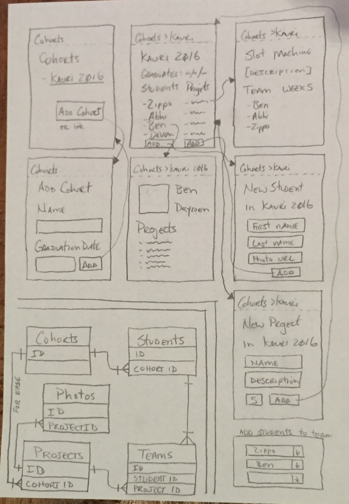

# Group Projects

> Capturing the awesomeness that is EDA group projects

This version of the readme serves only as a notepad for dev notes. When it grows up it will be useful to other developer who would like to run this locally or contribute.

## Initial thinking

Initially this app serves a singular purpose: to help flesh out the phase 2 curriculum. You see, this app represents what students should be able to build by the end of phase 2 - all of it: React components, web API, data storage and access, etc.

## Data model

* Cohort HAS MANY Students
* Cohort HAS MANY Projects
* Team HAS MANY Students
* Team HAS ONE Project
* Student HAS MANY Teams
* Project HAS MANY Photos

* Cohort
  - name: varchar(64)
  - graduation: date

* Student
  - firstName: varchar(128)
  - lastName: varchar(128)
  - photoUrl: varchar(256)
  - cohortId: integer (FK)

* Project
  - name: varchar(128)
  - description: varchar(1024)
  - week: integer

* Team (join table)
  - studentId: integer (FK)
  - projectId: integer (FK)

* Photos
  - photoUrl: varchar(256)
  - projectId: integer (FK)

## View listing (components)

* Cohort listing
* Add cohort
* Cohort details
  * Student listing
* Add student to cohort
* Student details
* Add project
* Add student to project/team
* Project listing
* Project details
  * Student listing
  * Photos listing

## API endpoints

* /v1/cohorts (GET, POST)
* /v1/cohorts/:id (GET, PUT)
* /v1/cohorts/:id/students (GET, POST)
* /v1/students/:id (GET, PUT)
* /v1/cohorts/:id/projects (GET, POST)
* /v1/projects/:id (GET, PUT)
* /v1/projects/:id/students (GET, POST)
* /v1/projects/:id/photos (GET, POST)
